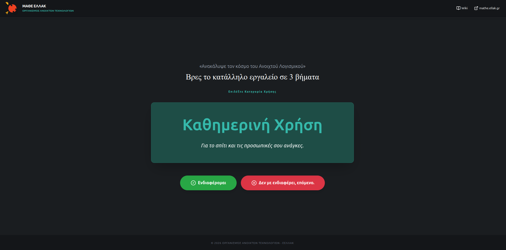

# Μάθε ΕΛ/ΛΑΚ

[](https://mathe-ellak.netlify.app/)

«Ανακάλυψε τον κόσμο του Ανοιχτού Λογισμικού»

Επίσημο Live Demo: [https://mathe-ellak.netlify.app/](https://mathe-ellak.netlify.app/)



Το **Μάθε ΕΛ/ΛΑΚ** είναι μια διαδραστική διαδικτυακή εφαρμογή του Οργανισμού Ανοιχτών Τεχνολογιών (ΕΕΛΛΑΚ) που βοηθάει τους χρήστες να βρουν το κατάλληλο Ελεύθερο Λογισμικό / Λογισμικό Ανοικτού Κώδικα (ΕΛ/ΛΑΚ) για τις ανάγκες τους (Καθημερινή Χρήση, Επαγγελματικά, Εκπαίδευση, Δημόσιο) με μόλις 3 βήματα.

## Χαρακτηριστικά

- **Διαδραστική Εξερεύνηση:** Βρείτε λογισμικό ανά κατηγορία με τη μορφή quiz/σεναρίων.
- **Εμπορικά Αντίστοιχα:** Κάθε προτεινόμενο εργαλείο ΕΛ/ΛΑΚ αναφέρει ξεκάθαρα ποιο διαδεδομένο εμπορικό λογισμικό αντικαθιστά.
- **Γρήγορα & Σίγουρα Αποτελέσματα:** Eager loading των δεδομένων εφαρμογής.
- **Μοντέρνος Σχεδιασμός:** Κατασκευασμένο με React, Vite, Tailwind CSS 4+ και Framer Motion.

## Τεχνολογίες

- [React 19](https://react.dev/)
- [Vite](https://vitejs.dev/)
- [Tailwind CSS](https://tailwindcss.com/)
- [Framer Motion](https://www.framer.com/motion/)
- [Lucide React](https://lucide.dev/) (Icons)

## Τοπική Εκτέλεση Περιβάλλοντος

**Προαπαιτούμενα:** [Node.js](https://nodejs.org/) (προτείνεται η τελευταία LTS έκδοση)

1. Κλωνοποιήστε το αποθετήριο:
   ```bash
   git clone https://github.com/iosifidis/mathe-ellak.git
   cd mathe-ellak
   ```

2. Εγκαταστήστε τις βιβλιοθήκες/εξαρτήσεις:
   ```bash
   npm install
   ```

3. Εκκινήστε τον server ανάπτυξης (development server):
   ```bash
   npm run dev
   ```

Η εφαρμογή θα ξεκινήσει τοπικά, συνήθως στο `http://localhost:3000`.

## Build με Docker

Για να χτίσετε και να τρέξετε την εφαρμογή ως container χρησιμοποιώντας το παρεχόμενο `Dockerfile`:

1.  **Build** της εικόνας:
    ```bash
    docker build -t mathe-ellak .
    ```

2.  **Run** το container:
    ```bash
    docker run -p 8080:80 mathe-ellak
    ```

Μετά την εκτέλεση, η εφαρμογή θα είναι διαθέσιμη στο `http://localhost:8080`.
Αν επιθυμείτε να χτίσετε την εφαρμογή για διαφορετικό base URL (όπως π.χ. στο GitHub Pages), μπορείτε να χρησιμοποιήσετε την παράμετρο `VITE_BASE`:
```bash
docker build --build-arg VITE_BASE=/custom-base/ -t mathe-ellak-custom .
```

## Scripts

- `npm run dev` - Εκκίνηση της εφαρμογής σε περιβάλλον ανάπτυξης.
- `npm run build` - Δημιουργία production-ready φακέλου `dist`.
- `npm run preview` - Τοπική δοκιμή του built project.
- `npm run lint` - Έλεγχος TypeScript (μέσω `tsc --noEmit`).

## Πνευματικά Δικαιώματα

© 2026 Οργανισμός Ανοιχτών Τεχνολογιών - ΕΕΛΛΑΚ.
